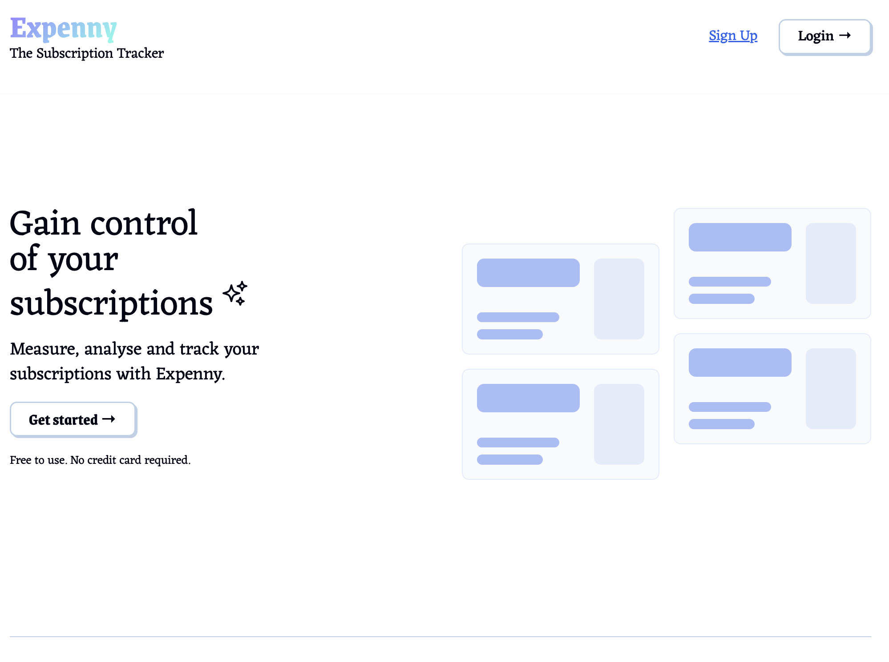
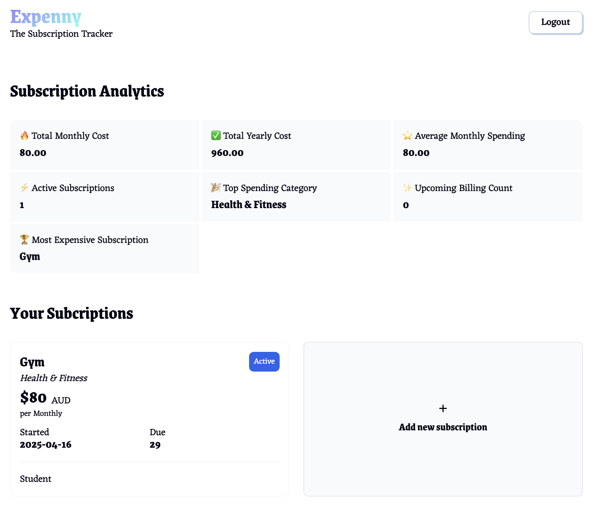

# Expenny – The Subscription Tracker 💸

Track, manage, and stay on top of your subscriptions in real-time.

A full-stack **Next.js + Firebase** app with secure auth, Firestore database, and real-time analytics — originally built to practice full-stack concepts before rebuilding the backend in .NET.

---

## 🔐 Live Demo

**🌐** [Live App (Netlify)](https://subscription-tracking.netlify.app)
**💻** [Frontend Repo (GitHub)](https://github.com/tomlhennessy/expenny)

---

## 🧰 Tech Stack

- **Frontend:** React · Next.js (App Router)
- **Backend & Auth:** Firebase Authentication · Firestore
- **Styling:** TailwindCSS
- **Hosting:** Netlify

---

## 🚀 Features

- ✅ **User Authentication** (Firebase Auth)
- ✅ **Add / Edit / Delete Subscriptions**
- ✅ **Real-Time Firestore Sync** (live updates across sessions)
- ✅ **Dashboard Analytics:**
  - Total monthly & yearly cost
  - Average monthly spending
  - Most expensive sub
  - Upcoming bills (next 7 days)
  - Top spending category

---

## 📈 Why I Built This

Before moving into the .NET ecosystem, I wanted to solidify my understanding of full-stack concepts with Firebase. This version inspired the later rebuild using ASP.NET Core + Azure.

---

## 📸 Screenshots

| Dashboard | Analytics |
|----------|-----------|
|  |  |

---

## 💡 What I Learned

- Working with Firestore's real-time data listeners
- Firebase Authentication flows with React
- Building dynamic UI with React state + Tailwind
- Structuring a small-scale fullstack app
